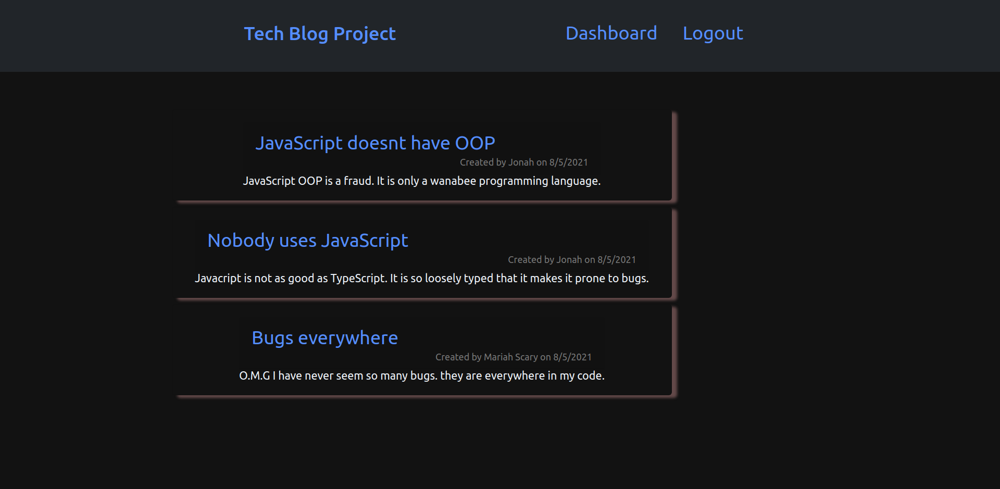

# Tech Blog Post

    
    

## Table of Contents
    
* [Description](#description)
* [Installation](#installation-instructions)
* [Usage Info](#usage-info)
* [contribution](#contribution)
* [Testing Instructions](#test-instructions)
* [License](#license)
* [Questions](#questions)
    
## Deployed application screenshot

## Description
    A very cool tech blog developed from scratch where users can post about
    their thoughts on tech related subjects and also comment on other users posts.
    The front-end used Css and javaScript languages.The back-end used Javascript
    and Node. On the server side NPM dependencies  used include Express, Sequelize, 
    bcrypt, mysql2, and others. The database platform used was MySQL.

## Installation Instructions
    no installation necessary. Open the following link, signup and have fun:
[Deployed application](https://boiling-gorge-34353.herokuapp.com/)

## Usage info
    Use at you own discretion

## Contribution
    contribution is welcomed if requested.

## Test Instructions
    testing is not implemented on this version of the application   

## License
    This project is covered under MIT license.

## Questions
    For questions please refer to 
      
    or
    romulojusto@gmail.com
    
